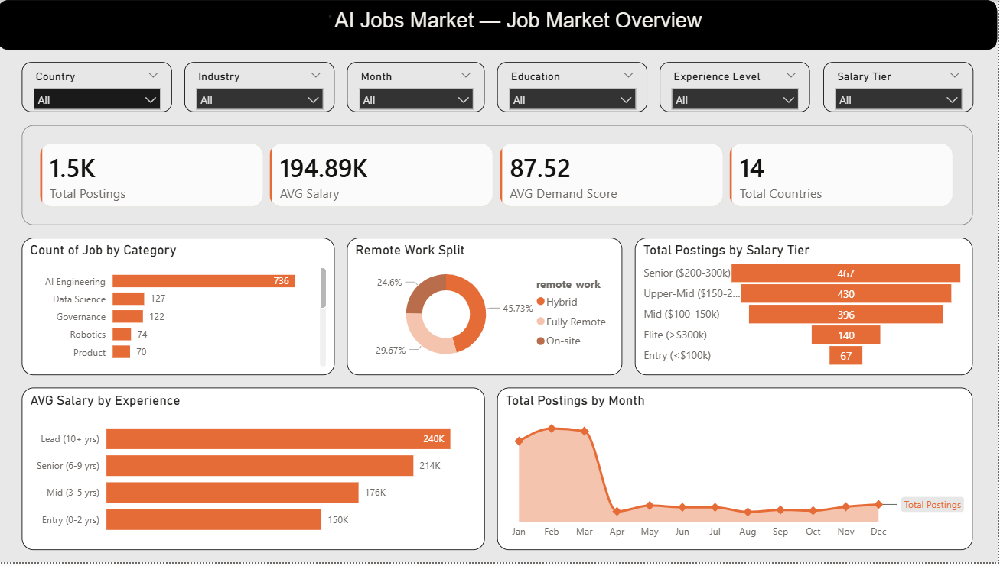
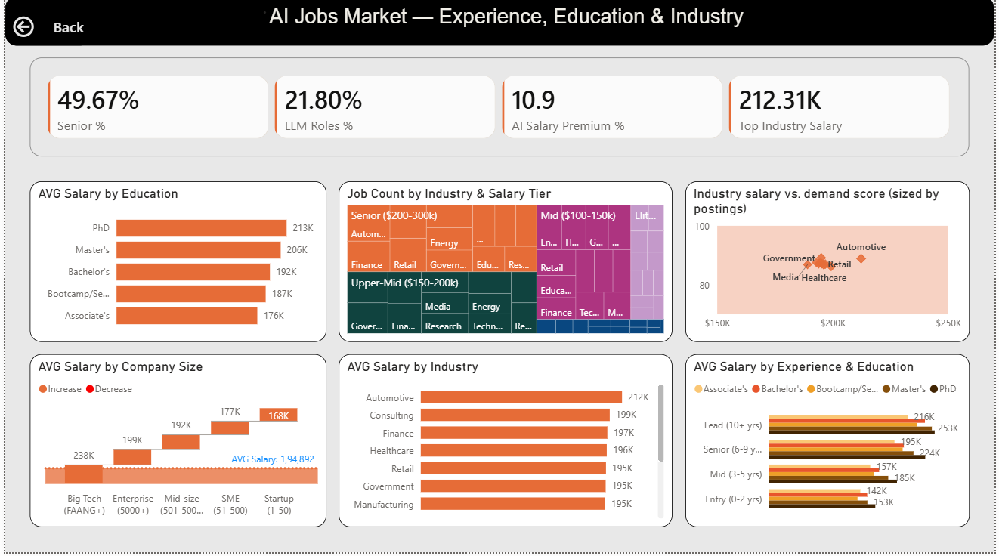

# 🤖 AI Job Market Dashboard

An end-to-end Business Intelligence and Analytics project analyzing the global AI job market using SQL Server and Power BI.

This project combines:
- Data warehouse design
- Star schema modeling
- ETL workflows
- Advanced DAX measures
- Interactive dashboard development
- Business insight generation

The solution analyzes 1,500+ AI job postings across 14 countries to uncover trends in:
- AI hiring demand
- Salary intelligence
- Remote work adoption
- Experience-level compensation
- Industry hiring behavior
- LLM-focused role growth

---

# 📌 Business Problem

The rapid expansion of Artificial Intelligence has transformed global hiring patterns, salary structures, and workforce demand.

This project was built to answer critical business questions such as:

- Which AI roles command the highest salaries?
- Which industries are investing most aggressively in AI talent?
- How does remote work affect compensation?
- Which experience levels dominate AI hiring?
- How significant is the salary premium for AI-focused roles?
- How quickly are LLM-related jobs growing?

The dashboard enables business leaders, analysts, recruiters, and job seekers to better understand the evolving AI workforce landscape.

---

# 🏗️ Solution Architecture

## Data Pipeline

Raw CSV Dataset
→ SQL Server Staging Layer
→ Star Schema Data Warehouse
→ Power BI Semantic Model
→ Interactive Analytics Dashboard

---

# 🗂️ Data Warehouse Design

## Star Schema — `AI_Jobs_DW`

### Fact Table
- `Fact_JobPostings`

### Dimension Tables
- `Dim_Date`
- `Dim_JobCategory`
- `Dim_Experience`
- `Dim_Education`
- `Dim_Country`
- `Dim_RemoteWork`
- `Dim_CompanySize`
- `Dim_Industry`
- `Dim_SalaryTier`

### Warehouse Features
- Surrogate keys
- Persisted computed columns
- Explicit foreign key constraints
- Optimized analytical relationships
- Business-friendly ordinal sorting columns

---

# 📊 Dashboard Preview

## Executive Overview


## Workforce & Industry Analytics


---

# 📈 Key Business Insights

## AI Engineering Dominates Hiring
AI Engineering roles account for nearly half of all postings, significantly outperforming Data Science and Analytics roles.

## Hybrid Work Leads the Market
Hybrid work models represent the largest share of AI job postings, exceeding both fully remote and on-site opportunities.

## Senior Talent Drives the Market
Nearly 50% of all AI job postings target senior-level professionals, highlighting strong demand for experienced talent.

## LLM Roles Continue Rapid Growth
Over 21% of all postings are LLM-focused, reflecting accelerating enterprise investment in Generative AI technologies.

## Big Tech Maintains Salary Leadership
Large technology companies offer substantially higher compensation compared to startups and smaller organizations.

## Education Premium Increases with Experience
The salary gap between advanced degrees and lower education levels widens significantly at senior leadership levels.

---

# 📌 Dashboard Features

## Page 1 — AI Job Market Overview

### KPIs
- Total Job Postings
- Average Salary
- Average Demand Score
- Countries Analyzed

### Analytics Included
- Job category distribution
- Remote work segmentation
- Salary tier analysis
- Experience-level salary comparison
- Monthly hiring trends

---

## Page 2 — Workforce & Industry Analytics

### KPIs
- Senior Role %
- LLM Role %
- AI Salary Premium %
- Highest Paying Industry

### Analytics Included
- Salary by education level
- Industry hiring distribution
- Salary vs demand correlation
- Company size compensation analysis
- Industry salary benchmarking
- Experience vs education salary analysis

---

# 🛠️ Tech Stack

| Technology | Purpose |
|---|---|
| SQL Server 2019 | Data warehouse and ETL |
| T-SQL | Data transformation and modeling |
| Power BI Desktop | Dashboard development |
| DAX | KPI calculations and business metrics |
| Power Query | Data preparation |

---

# 📂 Repository Structure

```text
AI-Job-Market-Power-BI-Dashboard/
│
├── sql/
│   ├── 01_create_schema.sql
│   └── 02_load_data.sql
│
├── images/
│   ├── img1.png
│   └── img2.png
│
├── ai_job_market.pbix
└── README.md
